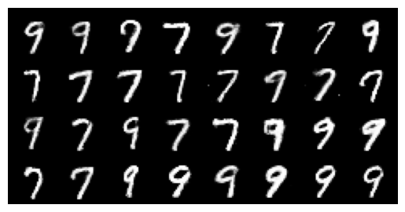
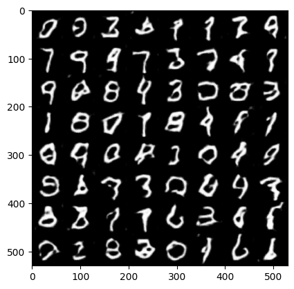
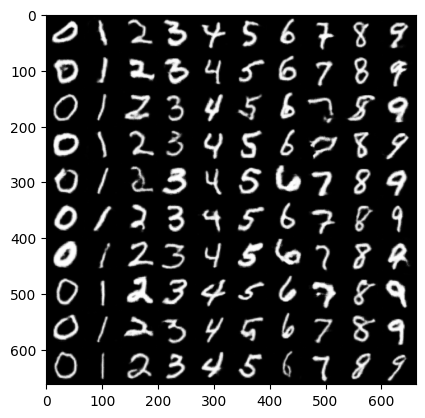
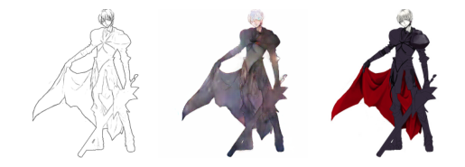

## Gans Collection

Pytorch implementations of Generative Adversarial Networks variants like `GAN`, `CGAN`, `DCGAN`, and `Pix2Pix`. This repository also includes brief summaries of some machine learning papers that have been used to develop models.

# Installation

```
$ git clone https://github.com/hungle45/gans-collection.git
$ pip install -r requirements.txt
```

# Experiment
## Digits Generation
For this task, MNIST dataset is used. You can download it from Kaggle [link](https://www.kaggle.com/datasets/hojjatk/mnist-dataset).

### GAN
**Result**
<p align="center">
     <br />
    <em>Generated digits by GAN</em>
</p>

### DCGAN
**Result**
<p align="center">
     <br />
    <em>Generated digits by DCGAN</em>
</p>


### CGAN
**Result**
<p align="center">
     <br />
    <em>Generated digits by CGAN with conditions 0..9 (from left to right)</em>
</p>


## Sketch2Color Translation
### Anime Sketch Colorization Pair Dataset
For this task, Anime Sketch Colorization Pair dataset is used. You can download it from Kaggle [link](https://www.kaggle.com/datasets/ktaebum/anime-sketch-colorization-pair).

### Pix2Pix
**Trainnig logs**
<p align="center">
     <br />
    <em>Epoch 1</em>
</p>
<p align="center">
     <br />
    <em>Epoch 10</em>
</p>
<p align="center">
     <br />
    <em>Epoch 20</em>
</p>
<p align="center">
     <br />
    <em>Epoch 30</em>
</p>

**Result**
<p align="center">
     <br />
     <br />
     <br />
     <br />
    <em>1st col: Input / 2nd col: Generated / 3rd col: Target</em>
</p>
